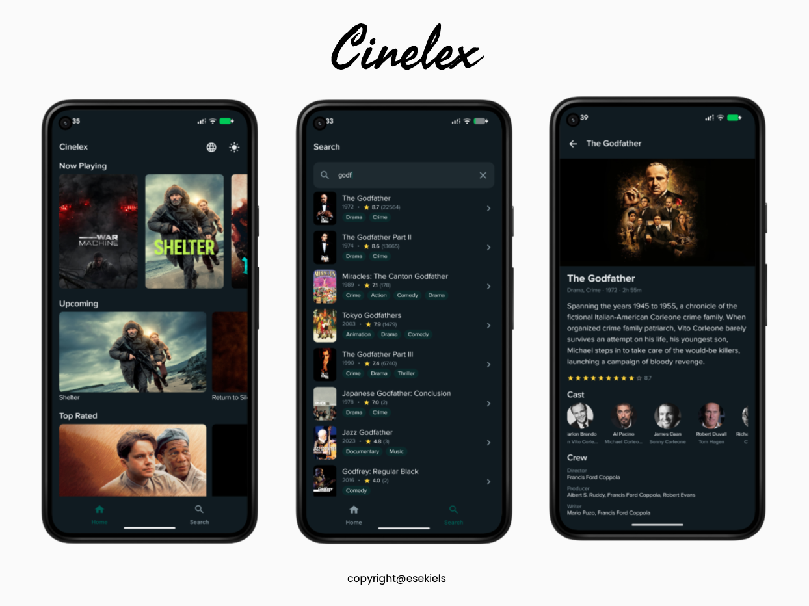

<h1 align="center">Cinelex</h1>

<p align="center">A movie discovery Android app built with Jetpack Compose, featuring modular clean architecture, offline-first caching, runtime theme & language switching, and unit test coverage.</p>

<p align="center">


</p>

## Features

- Browse movies by Now Playing, Popular, Top Rated, and Upcoming
- Search movies with paginated results
- Movie details with cast, crew, and trailer links
- Light / Dark / System theme switching
- English / Indonesian language switching (UI + API)
- Offline-first with Room caching

## Setup

1. Get your API token from [TMDB](https://www.themoviedb.org/settings/api) (free account)
2. Open `local.properties`
3. Add the following:

```
TOKEN=YOUR_TMDB_TOKEN_HERE
```

## Tech Stack

- **[Kotlin](https://kotlinlang.org/)** — Primary language with [Coroutines](https://github.com/Kotlin/kotlinx.coroutines) + [Flow](https://kotlin.github.io/kotlinx.coroutines/kotlinx-coroutines-core/kotlinx.coroutines.flow/) for async operations
- **[Jetpack Compose](https://developer.android.com/compose)** — Declarative UI toolkit with [Material 3](https://m3.material.io/)
- **[Navigation 3](https://developer.android.com/develop/ui/compose/navigation/navigation3)** — Type-safe Compose navigation
- **[ViewModel](https://developer.android.com/topic/libraries/architecture/viewmodel)** — Lifecycle-aware UI state management
- **[Room](https://developer.android.com/training/data-storage/room)** — SQLite abstraction layer for offline caching
- **[DataStore](https://developer.android.com/topic/libraries/architecture/datastore)** + **[Wire](https://github.com/square/wire)** — Proto-backed user preferences (theme, locale)
- **[Hilt](https://dagger.dev/hilt/)** — Dependency injection
- **[Retrofit 3](https://github.com/square/retrofit)** + **[OkHttp 5](https://github.com/square/okhttp)** — REST API networking
- **[Kotlinx Serialization](https://github.com/Kotlin/kotlinx.serialization)** — JSON parsing
- **[Coil 3](https://github.com/coil-kt/coil)** — Image loading & caching
- **[Detekt](https://github.com/detekt/detekt)** — Static code analysis
- **[Fastlane](https://fastlane.tools/)** + **[GitHub Actions](https://github.com/features/actions)** — CI/CD pipeline

## Architecture

MVVM + Repository pattern with unidirectional data flow which follows the [Google architecture guidance](https://developer.android.com/topic/architecture)

```
View → ViewModel → Repository → Service / DAO
                                  ↓        ↓
                               Network    Room
```

- **Composables** observe `StateFlow` from ViewModels
- **Repositories** coordinate remote (API) and local (Room) data sources
- **Offline-first** — cached data displays immediately, fresh data loads in background

## Modules

The project uses a multi-module Gradle setup with convention plugins:

```
app/                      # App entry point, DI setup, navigation host
├── core/
│   ├── common/           # Shared constants, extensions
│   ├── design/           # UI components, theme, shimmer placeholders
│   ├── navigation/       # Route definitions
│   ├── model/            # DTOs and data models
│   ├── network/          # Retrofit services, API client
│   ├── database/         # Room entities and DAOs
│   ├── data/             # Repositories (local + remote)
│   └── datastore/        # User preferences (theme, locale)
└── feature/
    ├── home/             # Movie carousels
    ├── search/           # Search with pagination
    └── details/          # Movie details, cast, trailers
```

## Testing

| Module   | Type | Coverage                          |
| -------- | ---- | --------------------------------- |
| Network  | Unit | Mocked API responses              |
| Database | Unit | In-memory Room                    |
| Data     | Unit | Mocked local/remote sources       |
| Feature  | Unit | ViewModels with mock repositories |

## CI/CD

GitHub Actions workflow on tag push (`v*`):

1. Run Detekt checks and unit tests via Fastlane
2. Build release APK
3. Upload APK to GitHub Releases

## API

[The Movie Database (TMDB)](https://www.themoviedb.org/) — free RESTful API for movie data, images, ratings, and more.

## License

```
Copyright 2026 Esekiel Surbakti

Licensed under the Apache License, Version 2.0 (the "License");
you may not use this file except in compliance with the License.
You may obtain a copy of the License at

    http://www.apache.org/licenses/LICENSE-2.0

Unless required by applicable law or agreed to in writing, software
distributed under the License is distributed on an "AS IS" BASIS,
WITHOUT WARRANTIES OR CONDITIONS OF ANY KIND, either express or implied.
See the License for the specific language governing permissions and
limitations under the License.
```
